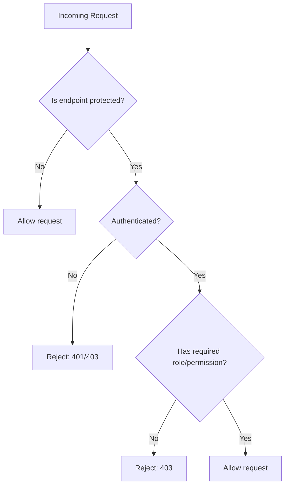
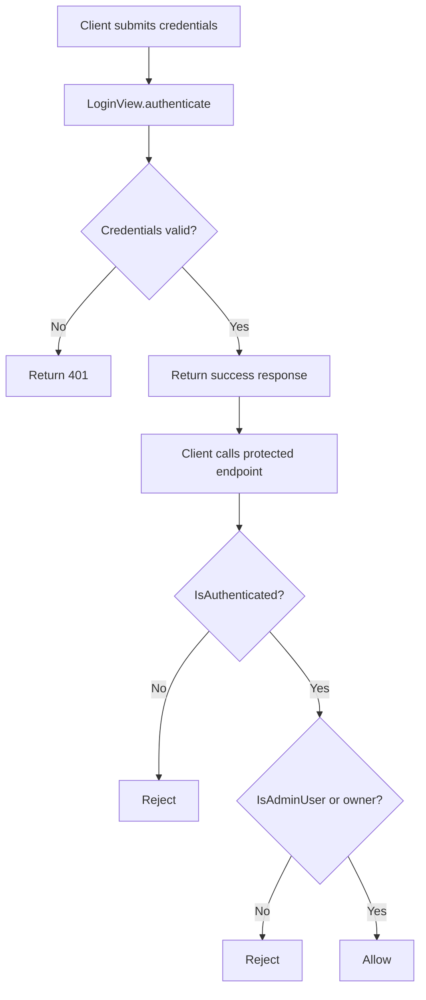
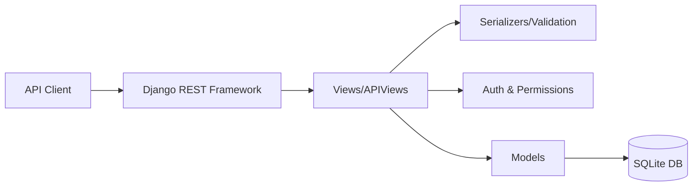
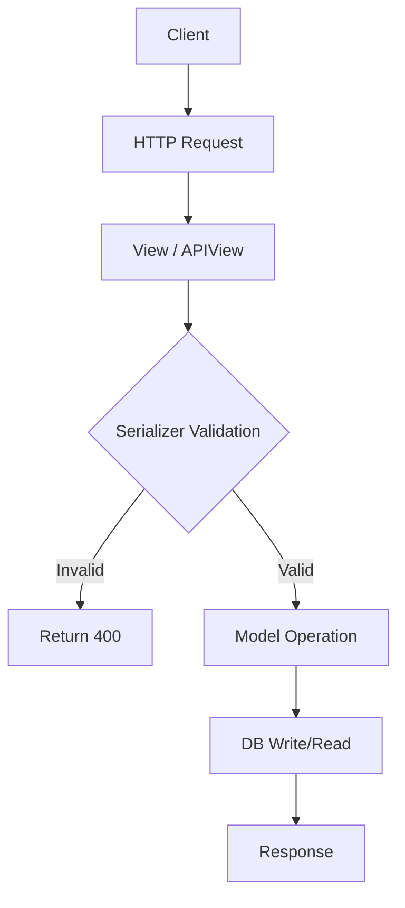

# Connectly API Documentation

## Overview
Connectly is a Django + Django REST Framework (DRF) API that provides user, post, and comment endpoints with authentication and authorization controls. The project includes a custom user model, DRF serializers for validation, and permission-protected API views. It also includes TLS certificates for local HTTPS development (see security notes). 

---

## Project Structure

```
Connectly-API-newver/
├─ connectly_project/        # Django project settings & URLs
├─ posts/                    # App with models, serializers, views, permissions
├─ manage.py                 # Django entrypoint
├─ cert.pem / key.pem        # TLS cert/key (dev)
└─ db.sqlite3                # SQLite database
```

---

## Key Features

### User Features
- Custom user model with a manager for creating users and superusers.
- Password hashing and standard password validators.
- Login endpoint to validate credentials.

### API Features
- CRUD-style endpoints for users and posts.
- DRF list/create endpoints for users, posts, and comments.
- Authentication and authorization using DRF permissions.

### Security Features
- Secure cookies and HSTS configuration in settings.
- Token-authenticated view for protected endpoints.

---

## Quick Start

### 1) Create a virtual environment
```bash
python -m venv .venv
source .venv/bin/activate
```

### 2) Install dependencies
```bash
pip install django djangorestframework django-extensions argon2-cffi
```

### 3) Run migrations
```bash
python manage.py migrate
```

### 4) Run the server
```bash
python manage.py runserver
```

If you want HTTPS in development and have `django-extensions` installed:
```bash
python manage.py runserver_plus --cert cert.pem --key key.pem
```

---

## Authentication & Authorization

### Authentication
- The `LoginView` accepts username/password and returns success/failure.
- `ProtectedView` requires authentication (token-based).

### Authorization
- `AdminOnlyView` requires an admin/staff user.
- `PostDetailView` denies access to users who are not the post author.

---

## API Endpoints

### Users
| Method | Path | Description |
|-------|------|-------------|
| POST | `/posts/users/create/` | Create user (function-based view) |
| GET | `/posts/users/read/<id>/` | Read user |
| PUT | `/posts/users/update/<id>/` | Update user |
| DELETE | `/posts/users/delete/<id>/` | Delete user |
| GET | `/posts/users/` | List users (DRF view) |
| POST | `/posts/users/` | Create user (DRF view) |

### Posts
| Method | Path | Description |
|-------|------|-------------|
| POST | `/posts/posts/create/` | Create post (function-based view) |
| GET | `/posts/posts/` | List posts (DRF view) |
| POST | `/posts/posts/` | Create post (DRF view) |

### Comments
| Method | Path | Description |
|-------|------|-------------|
| GET | `/posts/comments/` | List comments |
| POST | `/posts/comments/` | Create comment |

### Auth
| Method | Path | Description |
|-------|------|-------------|
| POST | `/posts/login/` | Login |

---

## Diagrams

### Access Control Decision Flow Diagram


### Authentication and Authorization Flow Diagram


### System Architecture Diagram


### CRUD Interaction Flow Diagram


---

## Troubleshooting

### Common Issues
1. **`ModuleNotFoundError: No module named 'rest_framework'`**
   - Install dependencies:  
     ```bash
     pip install djangorestframework
     ```

2. **HTTPS development errors**
   - Ensure `django-extensions` is installed for `runserver_plus`.
   - Verify `cert.pem` and `key.pem` exist and are readable.

3. **Authentication failing**
   - Ensure the user exists and the correct password is used.
   - Confirm that the `LoginView` endpoint is used for credential validation.

4. **CSRF issues on POST/PUT/DELETE**
   - The function-based endpoints are `@csrf_exempt`, but other views may require CSRF tokens if using session auth.
   - Prefer token auth for API calls.

---

## Testing

### Run Django tests
```bash
python manage.py test
```

### (Optional) Postman
There is a Postman collection in:
```
Wk 3 - Postman Test.postman_collection.json
```

---

## Notes on Certificates
- `cert.pem` and `key.pem` are **not per-user**; they are server-level TLS assets for development and do not identify individual users.

