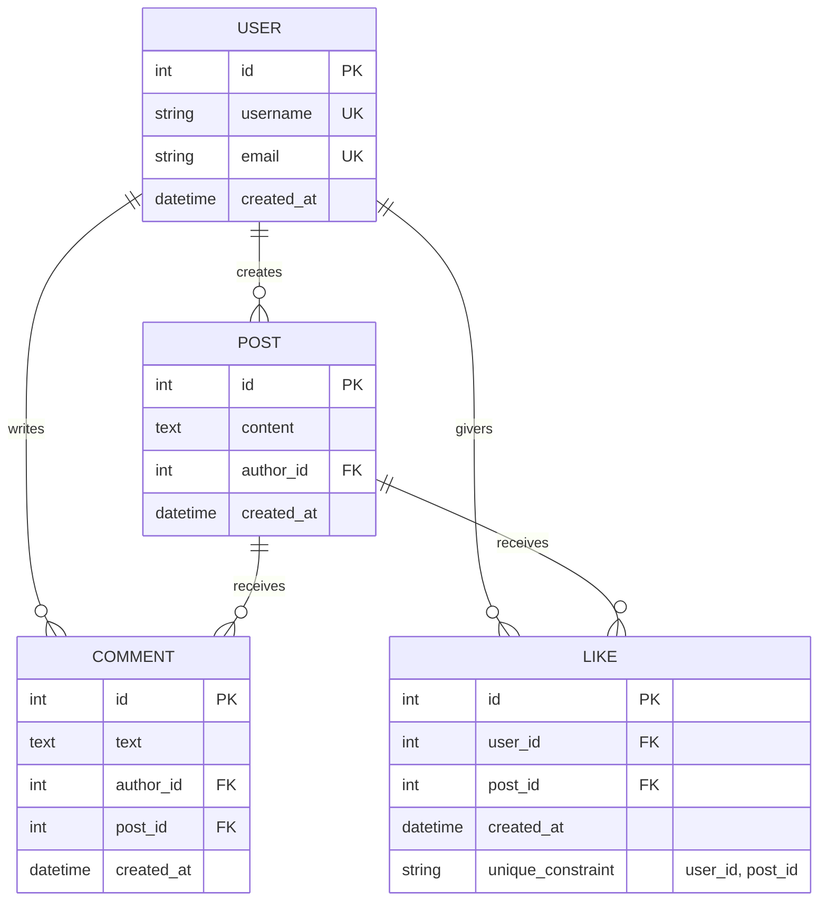
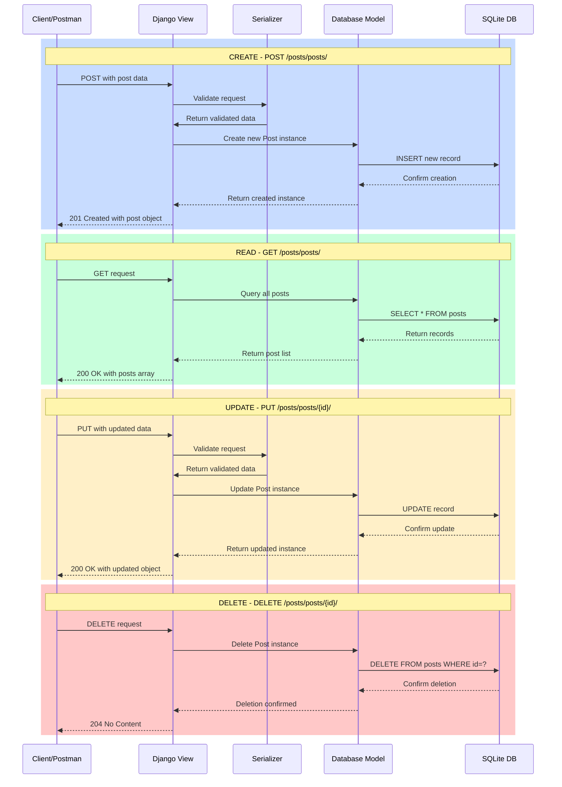
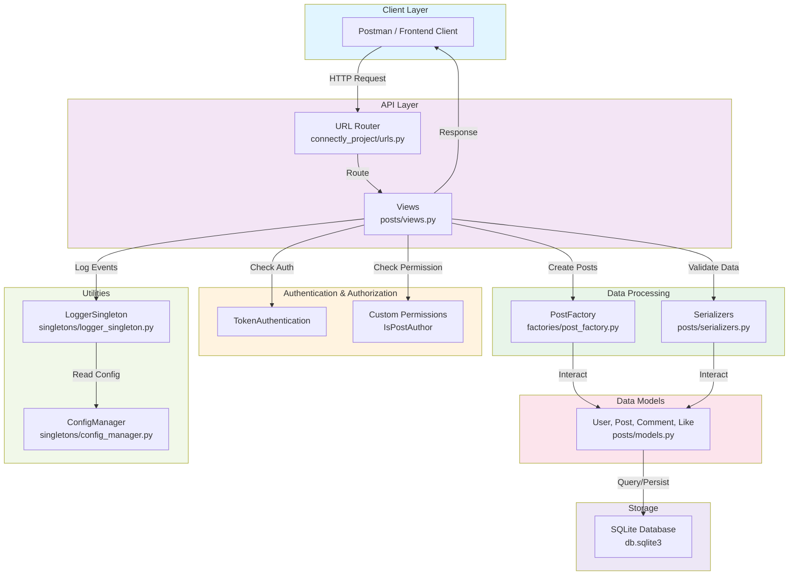
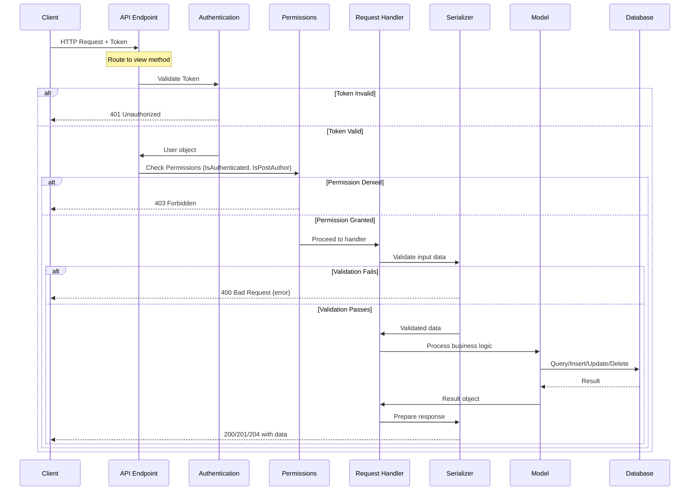
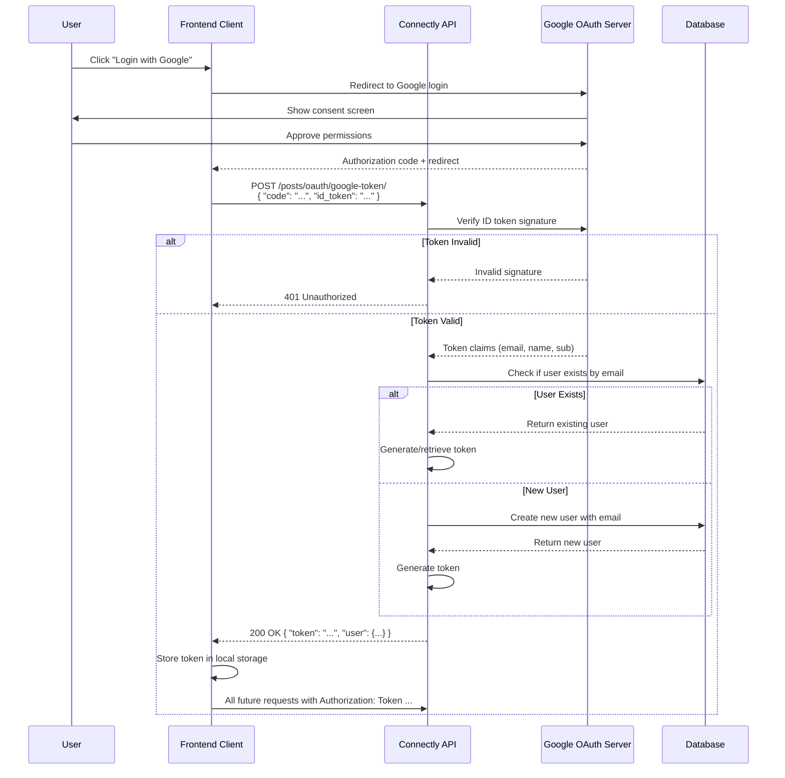

# Connectly Backend – Social API Platform

Connectly is a Django REST Framework backend powering a social media application. It provides core functionality for user management, posts, comments, likes, and personalized news feeds with token-based authentication.

**Milestone 2 Focus:** Post likes, post-scoped comments, Google OAuth integration, pagination, and news feed retrieval.

---

## Core Features

- **Likes System** – Per-post, per-user likes with duplicate prevention
- **Comments System** – Threaded comments on posts with newest-first ordering
- **Google OAuth Login** – Token exchange for third-party authentication
- **News Feed** – Personalized and global feed endpoints with pagination support
- **Pagination** – Comment and feed queries support configurable page sizes

---

## Architecture

The system follows REST principles with clear separation of concerns:

**Models:** User, Post, Comment, Like entities in SQLite database

**Serializers:** Input validation and API response formatting using Django REST Framework

**Views:** Authentication-protected endpoints with custom permission rules (IsPostAuthor for edit/delete)

**Authentication:** Token-based authentication maintained by TokenAuthentication middleware

**Design Patterns:**
- Factory Pattern: PostFactory enforces post creation logic
- Singleton Pattern: LoggerSingleton provides centralized logging

---

## Included Diagrams

The project documentation includes:
- Entity-Relationship Diagram (User, Post, Comment, Like relationships)
- API Flow Diagram (request/response sequences for CRUD operations)
- Google OAuth Flow Diagram (authentication handshake and token exchange)

---

## API Endpoints

**Users**
- GET /posts/users/
- POST /posts/users/

**Posts**
- GET /posts/posts/
- POST /posts/posts/
- GET /posts/posts/{id}/
- PUT /posts/posts/{id}/
- DELETE /posts/posts/{id}/

**Likes & Comments**
- POST /posts/posts/{id}/like/
- POST /posts/posts/{id}/comment/
- GET /posts/posts/{id}/comments/

**Authentication**
- POST /posts/token-auth/

---

## Diagrams

### 1. Entity-Relationship Diagram (ER)



---

### 2. CRUD Operations Flow



---

### 3. System Architecture



---

### 4. API Request/Response Flow



---

### 5. Google OAuth Authentication Flow



---

## AI Disclosure

This project utilized AI for:
- Troubleshooting and debugging guidance
- Architecture and design pattern clarification
- Documentation review and validation


---

## Development Tools

- **VS Code** – Primary development environment
- **Postman** - API test environment
- **Prettier** – Code formatting (Built-in VSC Extension in device)
- **Better Comments** – Enhanced code annotation and documentation (Built-in VSC Extension in device)
- **Mermaid Extension** - Enhanced diagrams translated into mermaid code

---

## Testing Summary

- **Postman Collection** – Comprehensive API testing with manual verification of all endpoints
- **OAuth Verification** – Tested Google token exchange and user profile retrieval
- **Pagination Validation** – Confirmed page size, count, and navigation parameters work correctly
- **Permission Testing** – Verified author-only access control and 403 error handling

---

## Setup Instructions

**Clone the repository:**

```bash
git clone <repository-url>
cd connectly_project
```

**Create virtual environment:**

**Windows:**

```bash
python -m venv env
env\Scripts\activate
```

**Mac or Linux:**

```bash
python3 -m venv env
source env/bin/activate
```

**Install dependencies:**

```bash
pip install -r requirements.txt
```

**Apply migrations:**

```bash
python manage.py makemigrations
python manage.py migrate
```

**Run development server:**

```bash
python manage.py runserver
```

**Server runs at:**

```text
http://127.0.0.1:8000/
```

---

## Contributors

| Name                  | Role        |
| --------------------- | ----------- |
| Camille Rose Umali    | Contributor |
| Shakira Angela Casusi | Contributor/Documenter/Tester |

Roles inferred from commit history in repository.

