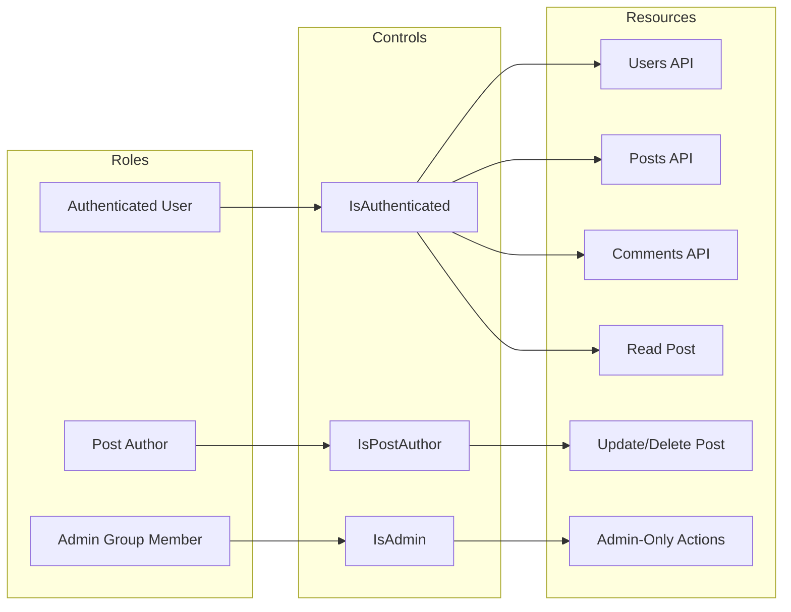
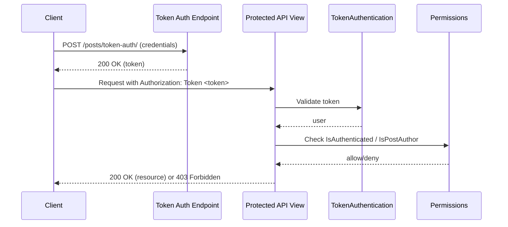
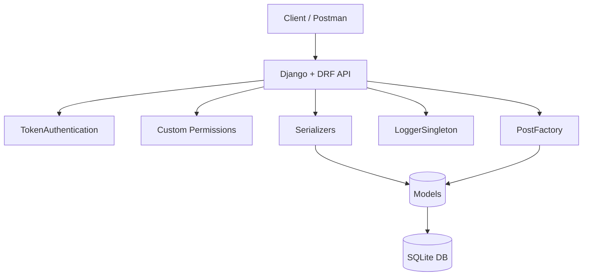
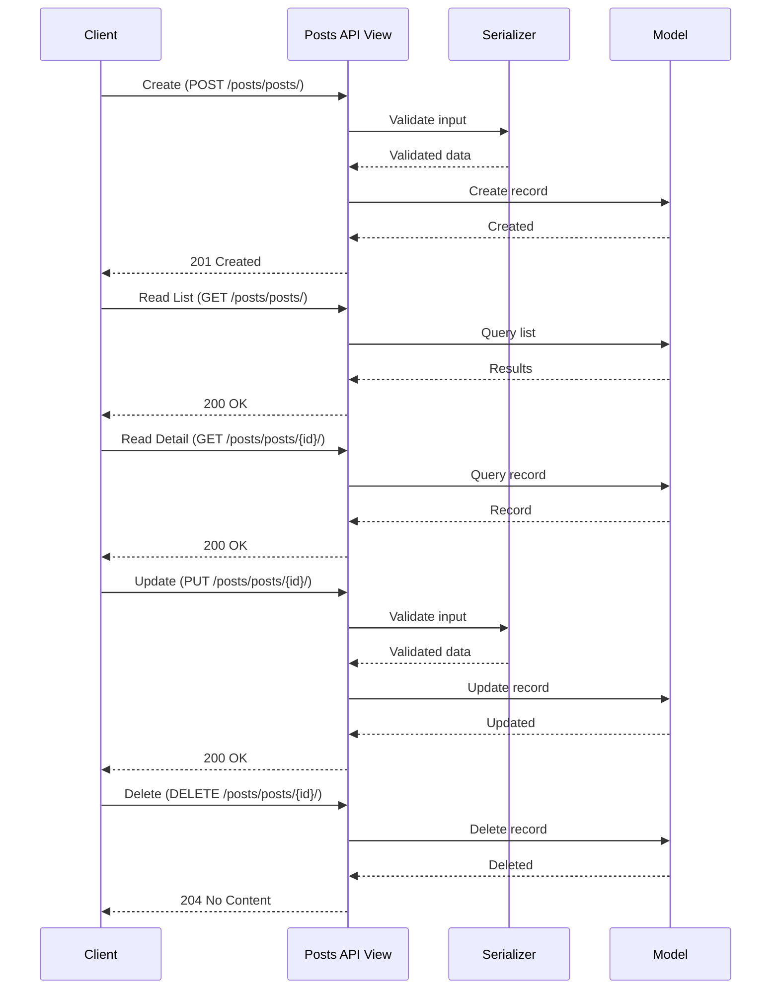
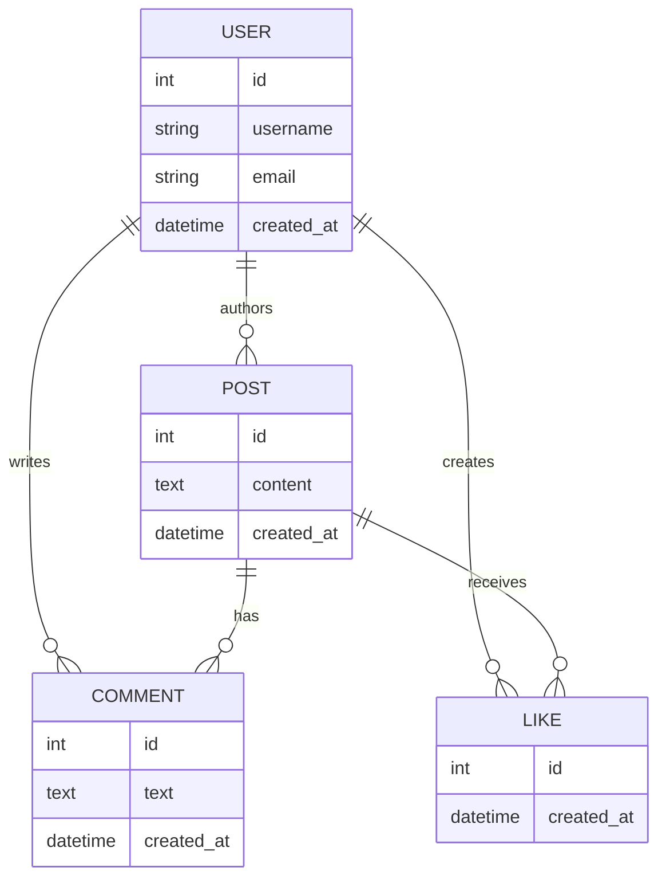
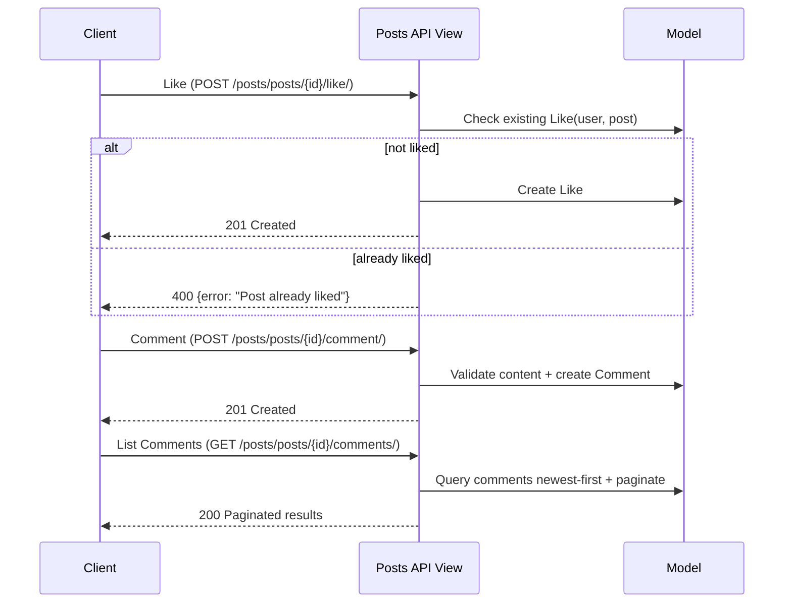

# Connectly API Documentation

**Connectly API** is a backend service built with Django and Django REST Framework. The API exposes REST endpoints for **Users**, **Posts**, and **Comments**. All endpoints use JSON. Token authentication protects resources. Object-level permissions restrict post updates and deletes.

---

## 1. Overview

Connectly provides a RESTful backend for basic social features.

**Primary scope**:
- Users
- Posts
- Comments

**Key goals**:
- Clean REST design
- Token-based authentication
- Author-only access control
- Clear separation of concerns
- Demonstration of design patterns

The API is tested using Postman.

---

## 2. Features

- User creation and listing
- Post CRUD operations
- Comment creation and listing
- Post likes (per-user, per-post)
- Post-scoped comments with pagination
- Token authentication using DRF
- Author-only permissions for post updates and deletes
- Structured logging
- Factory and Singleton patterns

---

## 3. System Architecture

**Core framework**:
- Django
- Django REST Framework

**Project structure**:
- connectly_project/  
  Project settings and root URLs

- posts/  
  Main application

**Key files**:
- posts/models.py  
  User, Post, Comment models

- posts/serializers.py  
  API input and output validation

- posts/views.py  
  API views with auth and permissions

- posts/permissions.py  
  Custom access rules

- factories/post_factory.py  
  Factory pattern for post creation

- singletons/logger_singleton.py  
  Shared logger instance

---

## 4. Data Model

**User:**
- username (unique)
- email (unique)
- created_at

**Post:**
- content
- author (foreign key to User)
- created_at

**Comment:**
- text
- author (foreign key to User)
- post (foreign key to Post)
- created_at

**Like:**
- user (foreign key to User)
- post (foreign key to Post)
- created_at
- unique per (user, post)

---

## 5. Setup Instructions

**Clone the repository:**

```bash
git clone <repository-url>
cd connectly_project
```

**Create virtual environment:**

**Windows:**

```bash
python -m venv env
env\Scripts\activate
```

**Mac or Linux:**

```bash
python3 -m venv env
source env/bin/activate
```

**Install dependencies:**

```bash
pip install -r requirements.txt
```

**Apply migrations:**

```bash
python manage.py makemigrations
python manage.py migrate
```

**Run development server:**

```bash
python manage.py runserver
```

**Server runs at:**

```text
http://127.0.0.1:8000/
```

---

## 6. API Reference

**Base path:**

```text
/posts/
```

### 6.1 Users

| Operation   | Method | URL           |
| ----------- | ------ | ------------- |
| List users  | GET    | /posts/users/ |
| Create user | POST   | /posts/users/ |

**Create user payload:**

```json
{
  "username": "jane_doe",
  "email": "jane@example.com"
}
```

---

### 6.2 Posts

| Operation     | Method | URL                | Access |
| ------------- | ------ | ------------------ | ------ |
| List posts    | GET    | /posts/posts/      | Auth   |
| Create post   | POST   | /posts/posts/      | Auth   |
| Retrieve post | GET    | /posts/posts/<id>/ | Author |
| Update post   | PUT    | /posts/posts/<id>/ | Author |
| Delete post   | DELETE | /posts/posts/<id>/ | Author |

**Create post payload:**

```json
{
  "post_type": "text",
  "content": "Hello world",
  "metadata": {}
}
```

**Post response:**

```json
{
  "id": 1,
  "content": "Hello world",
  "author": 1,
  "created_at": "2024-01-01T12:00:00Z",
  "comments": [],
  "like_count": 0,
  "comment_count": 0
}
```

---

### 6.3 Comments

| Operation      | Method | URL              |
| -------------- | ------ | ---------------- |
| List comments  | GET    | /posts/comments/ |
| Create comment | POST   | /posts/comments/ |

**Create comment payload:**

```json
{
  "text": "Nice post!",
  "post": 1
}
```

---

### 6.4 Likes + Post-Scoped Comments

These endpoints attach likes/comments to a specific post and return consistent error payloads:

```json
{ "error": "message" }
```

| Operation              | Method | URL                              |
| ---------------------- | ------ | -------------------------------- |
| Like a post            | POST   | /posts/posts/<id>/like/          |
| Comment on a post      | POST   | /posts/posts/<id>/comment/       |
| List comments on a post| GET    | /posts/posts/<id>/comments/      |

**Like a post**

- **Request**: `POST /posts/posts/1/like/`
- **Success (201)** example:

```json
{
  "id": 1,
  "user": 1,
  "post": 1,
  "created_at": "2026-02-18T18:23:00Z"
}
```

- **Duplicate (400)**:

```json
{ "error": "Post already liked" }
```

- **Missing post (404)**:

```json
{ "error": "Post not found" }
```

**Comment on a post**

- **Request**: `POST /posts/posts/1/comment/`

```json
{ "content": "Nice post!" }
```

- **Success (201)** example:

```json
{
  "id": 1,
  "content": "Nice post!",
  "author": 1,
  "post": 1,
  "created_at": "2026-02-18T18:25:00Z"
}
```

- **Empty content (400)**:

```json
{ "error": "Content cannot be empty" }
```

**Get comments on a post (newest first)**

- **Request**: `GET /posts/posts/1/comments/?page=1&page_size=5`
- **Default page_size**: 10
- **Response (200)** uses DRF pagination:

```json
{
  "count": 12,
  "next": "http://127.0.0.1:8000/posts/posts/1/comments/?page=2&page_size=5",
  "previous": null,
  "results": [
    { "id": 12, "content": "Latest", "author": 1, "post": 1, "created_at": "..." }
  ]
}
```

---

### 6.4 Authentication

| Operation    | Method | URL                |
| ------------ | ------ | ------------------ |
| Obtain token | POST   | /posts/token-auth/ |

**Authorization header:**

```text
Authorization: Token <token>
```

---

## 7. Security and Validation

**Authentication:**

* DRF TokenAuthentication

**Authorization:**

* IsAuthenticated on all endpoints
* IsPostAuthor for post update and delete

**Validation:**

* Serializers validate request data
* PostFactory enforces post-type rules

---

## 8. Design Patterns

**Factory Pattern:**

* PostFactory.create_post handles post creation logic and validation

**Singleton Pattern:**

* LoggerSingleton ensures one shared logger instance

---

## 9. Diagrams

### 9.1 Access Control Diagram


### 9.2 Authentication Flow Diagram



### 9.3 System Architecture Diagram


### 9.4 CRUD Diagram


### 9.5 Data Relationship Diagram (Extended)



### 9.6 Like + Post-Scoped Comment Flows



---

## 10. Troubleshooting

**401 Unauthorized:**

* Missing or invalid token

**403 Forbidden:**

* You are not the post author

**400 Bad Request:**

* PostFactory validation failed
* post_type or metadata mismatch

**Token issues:**

* Check token-auth endpoint setup
* Confirm correct user model

---

## 11. Example Request

```bash
curl -X POST http://127.0.0.1:8000/posts/posts/ \
  -H "Authorization: Token <token>" \
  -H "Content-Type: application/json" \
  -d '{"post_type":"text","content":"Hello","metadata":{}}'
```

---

## 13. Manual Testing Checklist (Likes + Comments)

- Create at least one Django auth user (via admin or existing setup) and obtain a token from `/posts/token-auth/`
- Ensure at least one Post exists (via admin or `POST /posts/posts/`)
- Like a post: `POST /posts/posts/1/like/` → **201**
- Like twice: same request → **400** `{ "error": "Post already liked" }`
- Like missing post: `POST /posts/posts/999/like/` → **404** `{ "error": "Post not found" }`
- Comment on a post: `POST /posts/posts/1/comment/` with `{ "content": "Nice post!" }` → **201**
- Empty comment: `{ "content": "" }` → **400** `{ "error": "Content cannot be empty" }`
- Comment missing post: `POST /posts/posts/999/comment/` → **404** `{ "error": "Post not found" }`
- Fetch comments: `GET /posts/posts/1/comments/` → **200** (newest first)
- Pagination: `GET /posts/posts/1/comments/?page=1&page_size=5` → **200** with `count/next/previous/results`

## 12. Contributors

| Name                  | Role        |
| --------------------- | ----------- |
| Camille Rose          | Contributor |
| Shakira Angela Casusi | Contributor/Documenter |

Roles inferred from commit history in repository.

