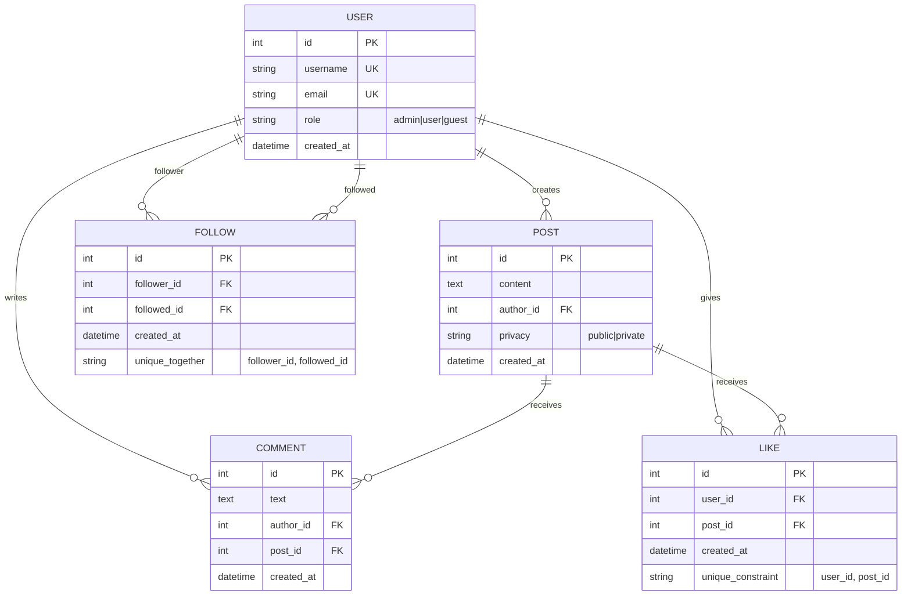
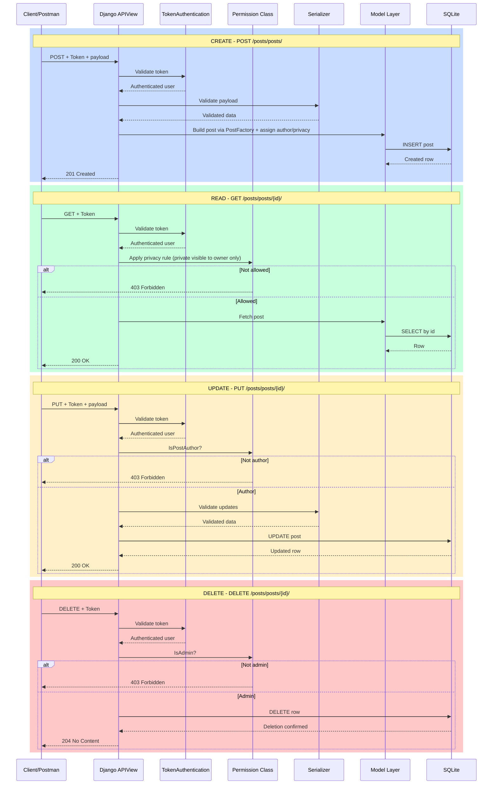
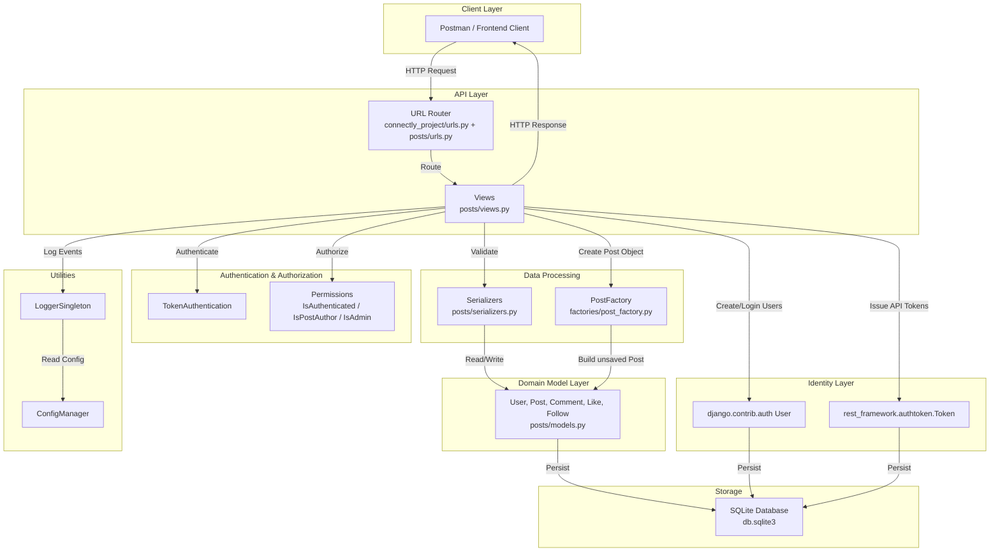
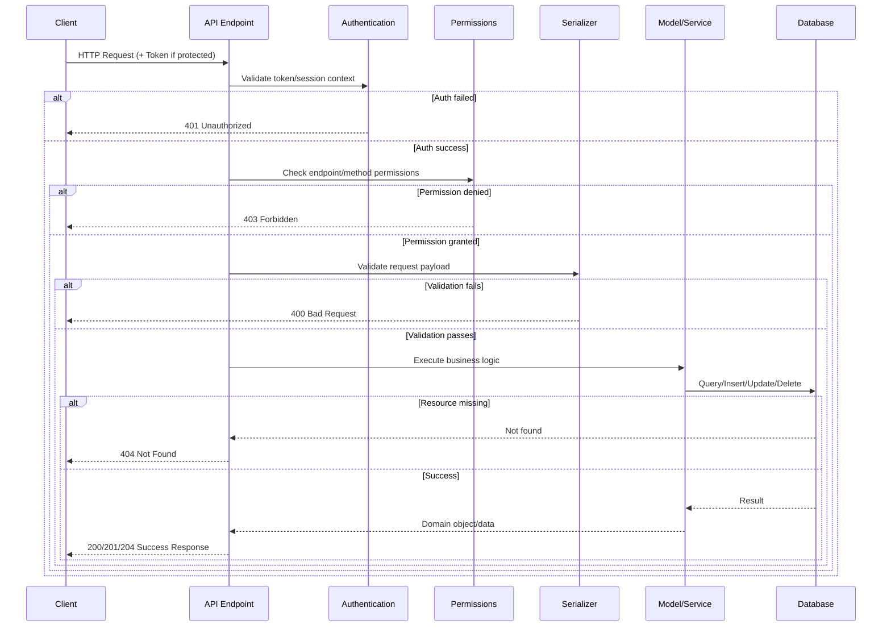
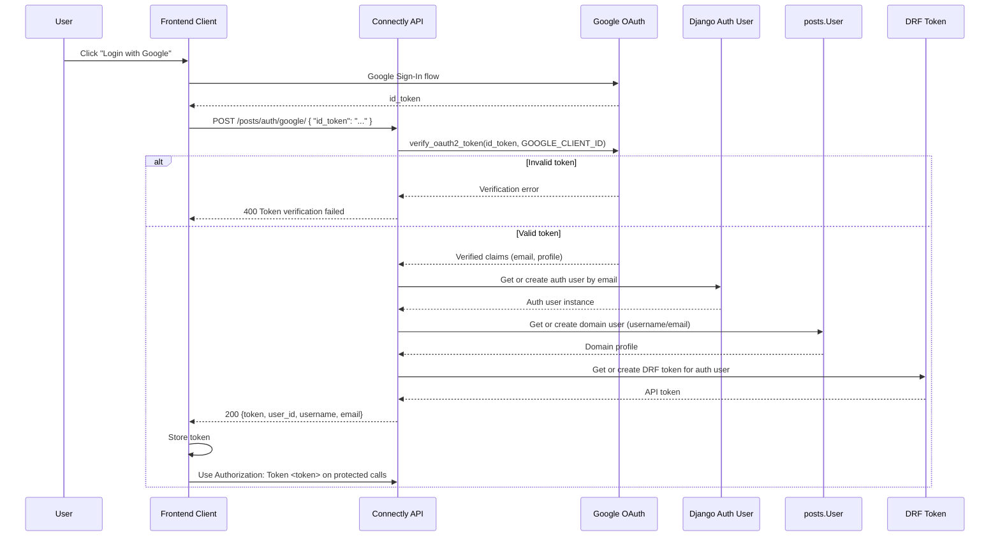

# Connectly API

Connectly is a Django REST Framework backend for a social media platform. It supports account registration, token-based authentication, post publishing with privacy controls, comments, likes, personalized feeds, and Google OAuth login.

**Current milestone scope:** Token-auth-compatible user onboarding, role-aware permissions, post privacy filtering, feed filtering (`global` vs `following`), and Google OAuth token exchange.

---

## Core Features

- **Dual user provisioning** – Registration creates both a Django auth user (for DRF token auth) and a domain profile (`posts.User`)
- **Token Authentication** – DRF `TokenAuthentication` across protected endpoints
- **Posts with Privacy Controls** – Public/private posts with privacy-aware retrieval rules
- **Role-Aware Authorization** – Author-only post edits and admin-only post/comment deletion operations
- **Likes System** – Per-user, per-post likes with duplicate-like prevention
- **Comments System** – Global and post-scoped comments with validation and pagination
- **Feed Retrieval** – Global feed and `following`-filtered feed variants with pagination
- **Google OAuth Login** – Accepts Google `id_token`, verifies it, and returns API token

---

## Architecture

The system follows REST conventions with modular app boundaries and explicit auth/permission layers.

**Models:**
- `posts.User` (domain profile with role)
- `posts.Post` (content + privacy)
- `posts.Comment`
- `posts.Like` (unique user/post pair)
- `posts.Follow` (follower/followed relationship)

**Serializers:**
- Dedicated serializers for user registration/listing, post payloads, comments, and likes
- Input validation for non-empty comment content and registration constraints

**Views:**
- APIViews for users, posts, comments, likes, post-scoped comments, feed retrieval, and OAuth login
- Method-specific permission handling (`GET`/`PUT`/`DELETE`) on post detail operations

**Authentication:**
- DRF `TokenAuthentication` default
- Public registration and Google login endpoints

**Authorization Rules:**
- `IsAuthenticated` baseline for protected routes
- `IsPostAuthor` for post updates
- `IsAdmin` for admin-only destructive actions

**Design Patterns in Codebase:**
- Factory Pattern: `PostFactory` centralizes post object construction
- Singleton Pattern: `LoggerSingleton` and `ConfigManager` utilities

---

## Included Diagrams

The documentation includes:
- Entity-Relationship Diagram (User, Follow, Post, Comment, Like)
- CRUD + Permission Flow Diagram (token auth + per-method permissions)
- System Architecture Diagram (routing, auth, permissions, serializer/model layers)
- API Request/Response Flow (validation and error branches)
- Google OAuth Flow Diagram (token verification and user/token provisioning)

---

## API Endpoints

Base prefix: `/posts/`

**Public / Authentication**
- `POST /posts/users/` – register user (creates auth + domain user)
- `POST /posts/token-auth/` – obtain DRF token (username/password)
- `POST /posts/auth/google/` – exchange Google `id_token` for API token

**Users**
- `GET /posts/users/` – list domain users (auth required)

**Posts**
- `GET /posts/posts/` – list posts
- `POST /posts/posts/` – create post
- `GET /posts/posts/{id}/` – retrieve post (privacy-aware)
- `PUT /posts/posts/{id}/` – update post (author-only)
- `DELETE /posts/posts/{id}/` – delete post (admin-only)

**Comments / Likes**
- `GET /posts/comments/` – list all comments
- `POST /posts/comments/` – create global comment payload (`post` required)
- `POST /posts/posts/{id}/like/` – like post
- `POST /posts/posts/{id}/comment/` – add comment to post using `{ "content": "..." }`
- `GET /posts/posts/{id}/comments/` – paginated post comments (newest-first)

**Feed / Diagnostics**
- `GET /posts/feed/` – paginated global feed
- `GET /posts/feed/?filter=following` – feed from followed users only
- `GET /posts/test-auth/` – token authentication debug endpoint

---

## Diagrams

### 1. Entity-Relationship Diagram (ER)



---

### 2. CRUD + Permission Operations Flow



---

### 3. System Architecture



---

### 4. API Request/Response Flow



---

### 5. Google OAuth Authentication Flow



---

## AI Disclosure

This project may use AI assistance for:
- troubleshooting and debugging support
- architecture/design clarification
- documentation drafting and refinement

---

## Development Tools

- **Python + Django** – Core backend framework
- **Django REST Framework** – API serialization, auth, response handling
- **SQLite** – Default local development database
- **Postman** – Manual API endpoint verification
- **Mermaid** – Architecture and flow documentation diagrams

---

## Testing Summary

- **Automated API tests (`posts/tests.py`)**
  - Likes and post-scoped comments behavior
  - Google OAuth endpoint logic (mocked Google verification)
  - Feed behavior for global vs `following` filter
- **Permission coverage**
  - Author-only and admin-only guards tested via API behavior
- **Pagination checks**
  - Comment and feed endpoints validate paginated responses

---

## Setup Instructions

**1) Clone the repository:**

```bash
git clone <repository-url>
cd Connectly/connectly_project
```

**2) Create and activate virtual environment:**

**Windows**

```bash
python -m venv .venv
.venv\Scripts\activate
```

**macOS / Linux**

```bash
python3 -m venv .venv
source .venv/bin/activate
```

**3) Install dependencies:**

```bash
pip install -r requirements.txt
```

**4) Run migrations:**

```bash
python manage.py makemigrations
python manage.py migrate
```

**5) Start development server:**

```bash
python manage.py runserver
```

**Default server URL:**

```text
http://127.0.0.1:8000/
```

---

## Contributors

| Name                  | Role                          |
| --------------------- | ----------------------------- |
| Camille Rose Umali    | Contributor                   |
| Shakira Angela Casusi | Contributor / Documenter / QA |

Roles inferred from project history and documentation context.
